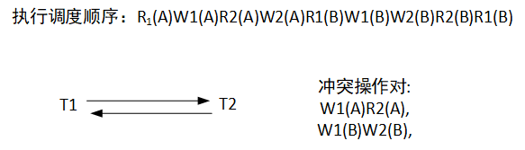
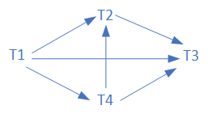

# 事务

## 事务的概念

> SQL Server 本身会将每一句Sql语句作为一个事务自动提交，我们所做的便是人工干预这一过程。

事务：保证指定的对数据库的一系列操作作为一个整体被执行，在最终提交操作之前，用户可以随时取消前面的操作，将数据库还原到没有执行操作前的状态，或者操作全部完成，将所有操作提交到数据库。*缓存操作*

事务的特性：ACID特性

**原子性**（Atomicity）：一个事务是一个不可分割的工作单位，事务的操作要么都做，要么都不做。

**一致性**（Consistency）：事务必须是使数据库从一个一致性状态变到另一个一致性状态。

**隔离性**（Isolation）：一个事务的执行不能被其他事务干扰。

**持久性**（Durability）：一个事务一旦提交，它对数据库中数据的改变就应该是永久性的，接下来的其他操作或故障不应该对其有任何影响。

## SQL Server三种常见的事务

**自动提交事务**：SQL-Server默认的事务模式，每条SQL语句都被看成一个事务进行处理。

**显式事务**：T-SQL标明，由Begin Transaction开启事务，由Commit Transaction提交事务，Rollback Transaction 回滚事务结束。

**隐式事务**：使用SetIMPLICIT_

## 事务的操作

#### 启动事务

~~~sql
begin tran[saction][事务名]
~~~

> 事务名仅使用前32字符

#### 回滚事务

~~~sql
rollback tran[saction][事务名]
~~~

#### 提交事务

提交事务标志着一个事务在执行过程中未产生任何错误及故障且事务成功结束。

~~~sql
commit tran[saction][事务名]
~~~

> 提交不可回滚，数据库已经进行了永久性修改

## 包含事务的存储过程

~~~sql
create proc 存储过程名
@参数名 参数类型[,...n]
as
begin try
	if exists()
        begin
        begin transaction	//开启事务
        SQL语句
        commit transaction	//提交事务
        end
	else
		//信息不存在
end try
begin catch
	rollback transaction	//回滚事务
end catch
~~~

> 若没有catch语句，当发生错误时，事务既无提交也无回滚，处于“无法结束”的状态。

五步创建包含事务的存储过程：

1. 确定存储过程中输入及输出参数
2. 确定事务的提交及回滚的条件
3. 列出事务包含的所有操作
4. 创建存储过程
5. 执行存储过程

## 设置事务的保存点

事务的保存点用来定义在按条件取消某个事务的一部分时，该事务可以返回的一个保存点位置。如果将事务回滚到事务保存点，则该事务保存点以后的操作无效。

> 保存点名称必须设置

~~~
save tran[saction] 保存点名
~~~

## 系统恢复

计算机系统故障是不可避免的。一旦故障发生，会对数据库中的数据造成破坏，因此，DBMS必须采取措施，以保障即使发生故障，也必须使数据库**恢复到故障发生前的某一个状态**，称为系统恢复技术。

### 以后备复本为基础的恢复技术

**周期性地把数据库中数据转储到磁盘上**。这就是后备复本。复本虽造成数据冗余，但是对恢复来说是必需的。当数
据库失效时，可取最近的后备复本来恢复数据库。
缺点：最近后备复本至发生故障期间所发生的数据库更新就会丢失，且取后备复本的周期愈长，丢失的数据更新也
就愈多

### 以后备副本和运行记录为基础的恢复技术

(1)前像：当数据库被一个事务更新时，所涉及的物理块**被更新前**的映像称为该事务的前像。
(2)后像：当数据库被一个事务更新时，所涉及的物理块**被更新后**的映像称为该事务的后像。

### 基于多副本的恢复技术

如果系统中有多个数据库副本，可以利用这些副本互为备份，用于恢复。**常用于分布式数据库系统中**。
读数据时，可以选择其中任一个结点上的数据；写数据时，每个结点都写入同样的内容。

### 处理故障的两种操作

1.执行commit前数据已保存到数据库，但此时还未执行commit发生了故障；**执行undo操作**。
以前像为参照，反向扫描日志，做逆操作恢复数据。

2.执行commit后数据才会被保存到数据库，但在commit之后保存数据库之前发生了故障；**执行redo操作**。
以后像为参照，正向扫描日志。

## 事务的并发控制

### 并发的概念

如果一个事务执行**完全结束后**，另一个事务**才开始**，则这种执行方式称为串行访问；如果多个事务**同时执行**，且在时间上**重叠执行**，则称这种执行方式为并发访问。

并发操作引起的错误：

1. 丢失更新：并发运行的两个事务从数据库**读取同一数据并进行修改**，其中一个事务的修改结果被覆盖丢失。由于丢失更新是两个事务对同一数据并发写入造成的，称为***“写-写冲突”***。
2. 不可重复读：并发运行的两个事务，在一个事务**读取数据后**，另一事务**更新数据**，使其无法再次读出先前的结果。由***读-写冲突造成***。
3. 脏读：并发运行的两个事务，其一事务修改数据后，另一事务读取数据，**但事务因某种原因回滚数据后**，导致另一事务读取结果和数据库中结果不一致，读到的为“脏数据”，**由读-写冲突造成**。*（读取的数据为中间状态数据）*
4. 幻读：并发运行的两个事务，其一事务查询数据，另一事务插入或删除数据，当事务再次查询时发现没有先前的数据或数据消失了。

> 错误主要由写的执行导致，只读事务的并发执行并不会造成错误
>
> 对写-写任何情况下都应该绝对避免，对读-写冲突应该避免，但有些应用场景也可以容忍。

### 事务的状态

记录每个事务的状态，以便在恢复时作不同的处理（COMMIT OR NOT COMMIT）。

### 并发控制

#### 锁机制

1. 加锁：事务在对某数据对象操作前，先向系统发出请求，对其加锁，如此其他事务便无法更新此数据对象。
   - 排他锁（写锁（X锁））：X锁只允许申请事务对数据对象**读取和修改**，直到事务释放X锁，否则所有其他事务不得对数据对象加任何锁。
   - 共享锁（读锁（S锁））：S锁允许申请事务对数据对象**读取但不能修改**，其他事务同时也可以读取，其他事务只能再对数据对象加S锁，直到事务释放S锁前，否则不得加X锁。
   - 修改锁（UPDLOCK）：SQL Server使用此锁替代共享锁，并将此锁保持至整个事务或命令结束。修改锁能保证**多个进程同时读取数据但只有该进程能修改数据**

   **S锁与X锁的相容矩阵**
   
   
   
2. 锁协议：加锁会降低事务的并发性；而锁协议**保证事务的一致性的前提**下尽可能地**提高并发性**。

   - 一级封锁协议：事务在修改数据对象前必须对其加X锁，**直到事务结束才释放**。事务结束包括正常结束（commit）和非正常结束（rollback）。*如果只是读取数据不修改，是不需要加锁的*

     **一级协议保证了修改不会丢失**，但无法保证重复读，不脏读和不发生幻读。

   - 二级封锁协议：一级封锁协议加上事务读取事务前必须对其加S锁，**读完后方可释放S锁**。

     **二级协议除保护了不会丢失修改，还防止了读“脏”数据**，不能保证可重复读和不发生幻读。

   - 三级封锁协议：一级封锁协议加上事务在读取数据前必须对其加S锁，**直到事务结束才释放**。

     **三级协议保证了四种错误均不会发生**。最安全的一种锁协议。

3. 死锁：指事务申请锁而未获准，则必须等待其他事务释放锁。如此便形成了事务间的等待关系。当事务中出现循环等待时，如不加干涉，则会一直等待下去，事务无法继续执行。

   解决死锁的两种办法

   - 设置死锁优先级：

     ~~~sql
     set deadlock_priority{low|normal|@deadlock_var}
     ~~~

   - 设置等待被阻塞资源的最长时间

     ~~~sql
     set lock_timeout[timeout_period]
     ~~~

4. 活锁：若某数据对象加了S锁，这时若有其他事务申请对它的X锁，则必须等待。如果不断有事务申请对此数据对象的S锁，以致它始终被S锁占有，而X锁定申请迟迟不能获准。

​		解决活锁的办法：先申请，先服务。

#### 设置事务的隔离级别

处理并发问题的另一途径。	

- 未提交读（read uncommitted）：(读取的为中间状态数据)

| 当前事务 | 其他事务（设置隔离级别） |
| -------- | ------------------------ |
| 读       | 能读，能修改             |
| 修改     | 能读，不能修改（可插入） |

- 已提交读（read committed）：

| 当前事务 | 其他事务（设置隔离级别）   |
| -------- | -------------------------- |
| 读       | 能读，能修改               |
| 可修改   | 不能读，不能修改（可插入） |

- 可重复读（repeatable read）：

| 当前事务（设置隔离级别） | 其他事务（设置隔离级别）   |
| ------------------------ | -------------------------- |
| 读                       | 能读，不能修改（可插入）   |
| 修改                     | 不能读，不能修改（可插入） |

- 可序列化（serializable）：

| 当前事务 | 其他事务（设置隔离级别） |
| -------- | ------------------------ |
| 执行操作 | 禁止并发执行操作         |

事务隔离级别与并发情况表：

| 隔离级别 | 脏读 | 丢失更新 | 不可重复读 | 幻读 |
| -------- | ---- | -------- | ---------- | ---- |
| 未提交读 | 是   | 是       | 是         | 是   |
| 已提交读 | 否   | 是       | 是         | 是   |
| 可重复读 | 否   | 否       | 否         | 是   |
| 序列化   | 否   | 否       | 否         | 否   |

> 事务隔离级别越高，事务执行效率越低。实际开发中，因根据情况合理设置隔离级别。

### 准则

> 依据为数据结构中的有向图

DBMS把**可串行化**作为并发控制正确性的准则!!!
判断是否可串行化的方法是**前趋图**。

根据是否有入度为零的点来判断是否可以串行化，存在则可串行化，不存在则不可串行化。

> 显然此处有回路，没有入度为零的点，所以不可串行化。

串行调度顺序则是取入度为零的点，然后删除对应的出度线，依次往下找另外一个。

例图的调度序列为：T1->T4->T2->T3。
