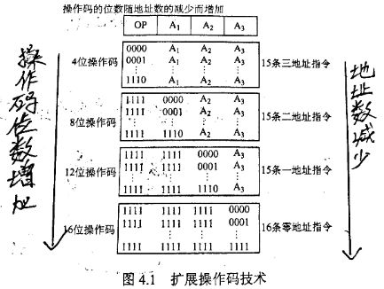

# 指令格式

指令是指示计算机执行某种操作的命令。**一台计算机的所有指令的集合构成该机的指令系统，也称指令集**。指令系统是计算的主要属性，是计算机硬件的语言系统，**与机器语言有关**，位于硬件和软件的交接面上。

## 指令的基本格式

**指令字长与机器字长没有固定的关系**。指令字长一般为字节的整数倍。  

在一个指令系统中，若所有指令的长度都是相等的，则称为**定长指令字结构**。若各种指令的长度随指令功能而异，则称为**变长指令字结构**。

依据操作数地码的数目，可将指令分为5种格式：

​		*指令的操作数的直接寻址范围为2n,n=操作数位数*

**1.零地址指令**

**2.一地址指令**

**3.二地址指令**

**4.三地址指令**

**5.四地址指令**

## 定长操作码指令格式

定长操作码指令的操作码位数固定处于最高位，**一般n位操作码字段的指令系统最大能够表示2n条指令**。

>  定长操作码对于简化计算机硬件设计和提高译码和识别速度很有利。

## 扩展操作码指令格式

为了在指令字长有限的前提下保持丰富的指令种类，可采用有变长度操作码。*操作码位数不固定，且分散地放置在指令字的不同位置上。*

